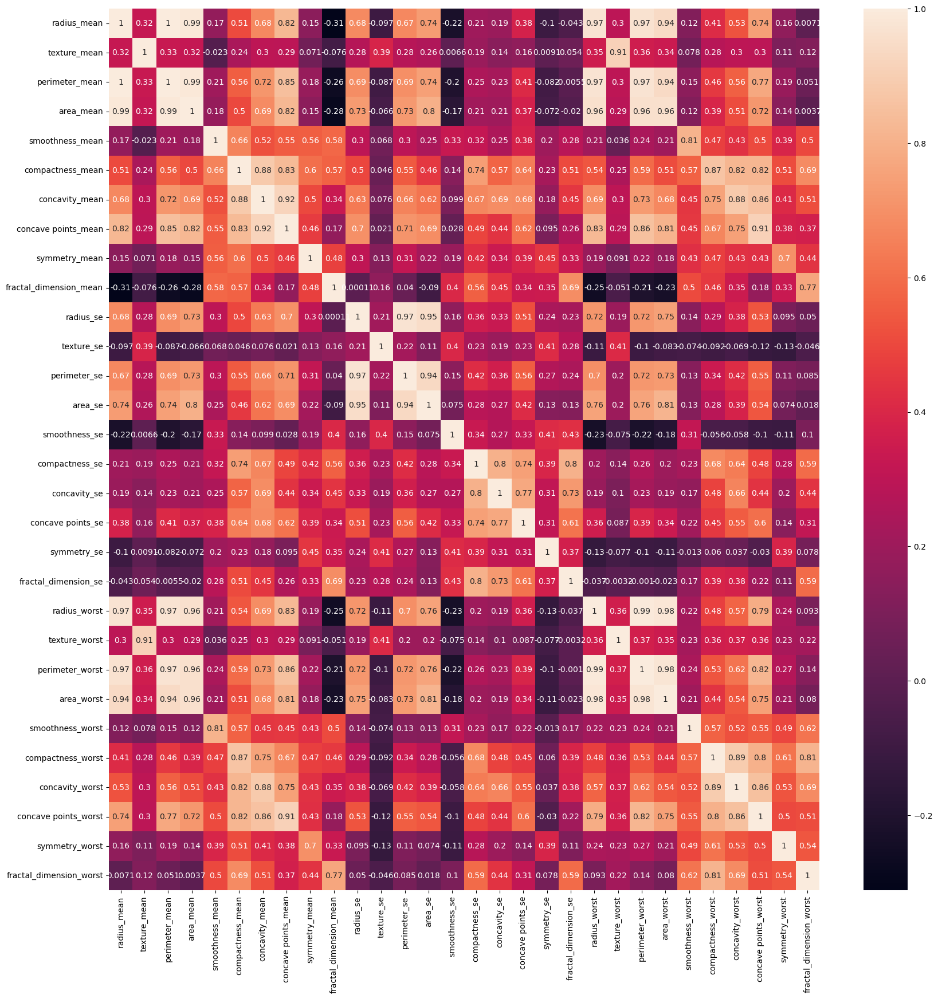
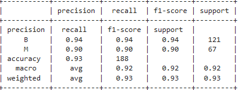

# Meme Kanseri Teşhisi İçin Makine Öğrenimi Algoritmalarının Karşılaştırılması

Bu proje meme kanseri üzerine 5 farklı makine öğrenimi (Decision Tree,K-NN,Naive Bayes,Random Forest,Support Vector Machine) algoritmasının uygulanması üzerinedir.

## Gereksinimler

- python3

- pip3 install -r requirements.txt

## Giriş
Meme kanseri, dünya genelinde sık görülen ve ciddi bir sağlık sorunudur. Erken teşhis, tedavi başarısını önemli ölçüde artırabilir. Bu çalışma, meme kanseri teşhisi için beş farklı makine öğrenimi algoritmasının uygulanmasını incelemektedir. Decision Tree, K-NN, Naive Bayes, Random Forest ve Support Vector Machine gibi popüler algoritmalar, meme kitlesi verilerinin analizinde karşılaştırılacaktır.

## Yöntem
Bu çalışmanın temel verisi, meme kanseri teşhisi için IIAB (İnce İğne Aspirasyon Biyopsisi) testlerinin sonuçlarını içeren bir veri setidir. Bu veri seti, her bir meme kitlesi için çeşitli metinsel ve sayısal özellikleri içermektedir. Sayısal özellikler, hücresel özelliklerin niceliksel açıklamalarını içermektedir.

Veri seti, meme kanseri teşhisi yapmak için kullanılacak olan bağımsız değişkenleri (özellikler) ve bağımlı değişkeni (meme kanseri teşhisi) içermektedir. Seçilen özellikler, literatürdeki önceki çalışmaların göz önünde bulundurulmasıyla belirlenmiştir. Bu özellikleri birkaç kelimeyle açıklamak istiyorum;

    'diagnosis': Bu sütun, hastaların meme kanseri teşhisini gösterir. İki farklı sınıf içerebilir: 'M' (Malignant, yani kötü huylu) veya 'B' (Benign, yani iyi huylu).

    'radius_mean': Tümörün merkezinden çevresine olan ortalama uzaklık (mm cinsinden).

    'texture_mean': Grinin 50 farklı tonunu ölçen piksel değerlerinin ortalama standart sapması.

    'perimeter_mean': Tümörün çevresinin ortalama uzunluğu (mm cinsinden).

    'area_mean': Tümörün alanının ortalama büyüklüğü (mm^2 cinsinden).

    'smoothness_mean': Tümör yüzeyinin düzensizlik derecesi.

    'compactness_mean': Tümörün kompaktlık ölçüsü.

    'concavity_mean': Tümörün konkavite (çöküntü) ölçüsü.

    'concave points_mean': Tümörün çıkıntılı noktaların (konkav noktalar) ortalama sayısı.

    'symmetry_mean': Tümörün simetri ölçüsü.

    'fractal_dimension_mean': Tümörün fraktal boyutunun ortalaması.

## Sonuçlar
Çalışmanın sonuçları, beş farklı makine öğrenimi algoritmasının meme kanseri teşhisi yapma yeteneklerini karşılaştıracaktır. Bu sonuçlar, her algoritmanın duyarlılık, ağırlık, doğruluk ve kesinlik gibi performans ölçütleri açısından nasıl performans gösterdiğini gösterecektir. Genel olarak, kullanılan algoritmaların doğruluk oranları %90 seviyelerindedir. Özellikle K-NN algoritması, %93'lük doğruluk oranıyla dikkat çeken bir algoritma olarak seçilmiştir.

### K-NN algoritmasının sonuçları

## İletişim

 Beni [LinkedIn](https://www.linkedin.com/in/muhammed-talha-bıçak) üzerinden takip edebilirsiniz.

 GitHub üzerinden takip edebilir ve mesaj gönderebilirsiniz: [@talha-bicak](https://github.com/talha-bicak)
